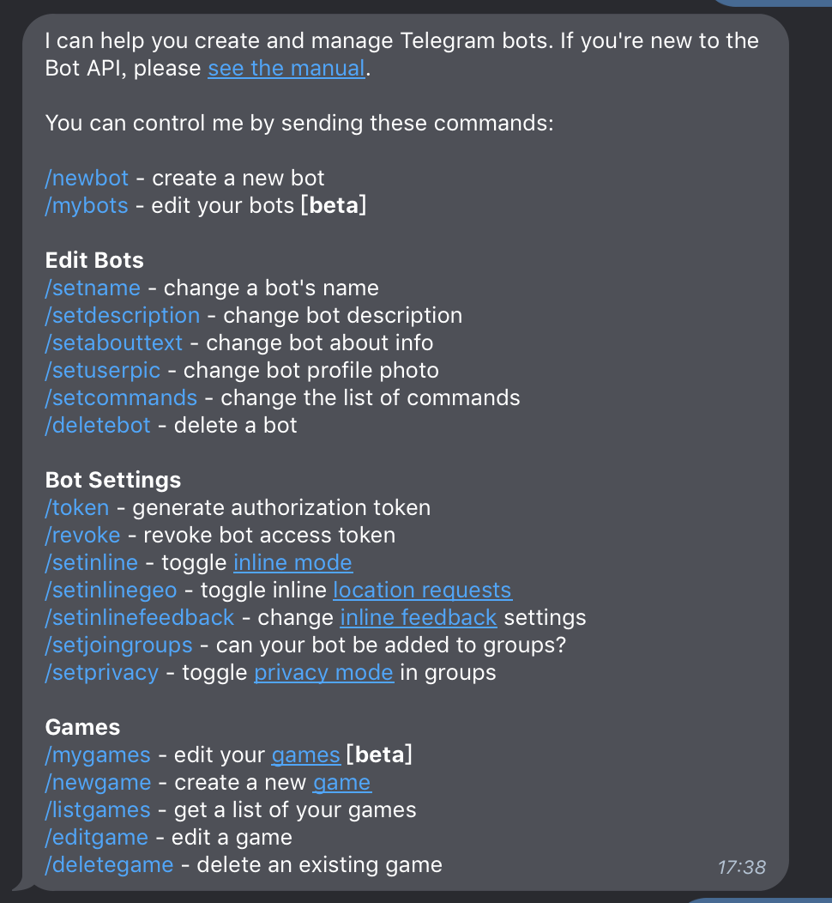
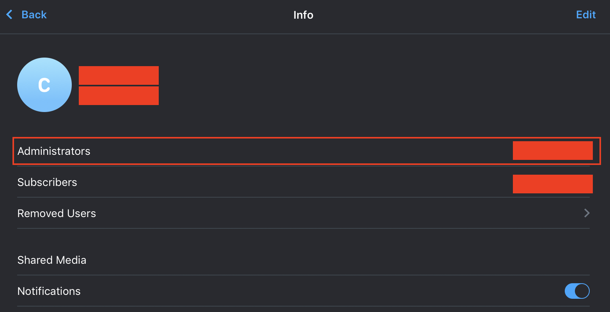
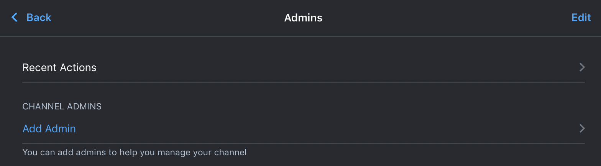

# 20190824

今天主题是 `Telegram` 的 BOT

## Telegram bot 申请流程

1. 首先需要有个 `Telegram` 账号（这其实是废话。。。）
2. 在 `聊天` 列表上方搜索 `@BotFather`
3. 在和 `@BotFather` 聊天对话里面输入 `/start` 会回复你以下资讯。



4. 接着输入 `/newbot` 开始创建流程
5. 首先要先给 Bot 命名（重复没关系）
6. 再给 Bot 一个 `username`（必须唯一，且要 `_bot` 结尾）
7. 完成后会收到以下讯息

```
Done! Congratulations on your new bot. You will find it at t.me/xxxxxxx_bot. You can now add a description, about section and profile picture for your bot, see /help for a list of commands. By the way, when you've finished creating your cool bot, ping our Bot Support if you want a better username for it. Just make sure the bot is fully operational before you do this.

Use this token to access the HTTP API:
123456789:xxx_xxxxxxxxxxxxxxxxxxxxxxxxx
Keep your token secure and store it safely, it can be used by anyone to control your bot.

For a description of the Bot API, see this page: https://core.telegram.org/bots/api

https://api.telegram.org/bot123456789:xxx_xxxxxxxxxxxxxxxxxxxxxxxxx/getMe
https://core.telegram.org/bots/api#available-methods
```

8. 可以使用 `/token` 来拿到 Bot 的 `token`

到这里基本上就算创建完成了，至于其他命令，就自己研究吧！我也还没开始玩很多。不过，我的目的是想透过 Bot 自动发送资料讯息到 `Telegram` 上，所以需要建立一个 `chat` 并让 Bot 发送我要的资料到这个 `chat` 里面。

## 添加 Bot 到 chat

1. 先建立一个 `chat` 或是在既有的 `chat` 中添加刚刚创建的 Bot
2. 打开右上角的菜单，进入 `info`

3. 点击 `Administrators`

4. 点击 `Add Admin` 并搜索自己的 Bot (`@` 设定给 Bot 的 `username`)


## 透过 shell 发送讯息

Bot 相关的 api 都在 [Tg api](https://core.telegram.org/bots/api)上，发送请求的格式为：

```
https://api.telegram.org/bot<token>/METHOD_NAME
```

而这个是发送讯息的 [api](https://core.telegram.org/bots/api#sendmessage)

从 `Tg api` 上可以发现，要传送讯息主要需要两个重要的资料，一个是发送 api 所需要的 Bot 的 `token` 及 `chat_id`，`token` 在申请 Bot 时候就可以拿到（透过 `/token`）。只差 `chat_id`

### 寻找 `chat_id`

1. 先行确认 Bot
    - 最快的方法就是直接将以下请求 Bot 资讯的 url 贴到浏览器的网址上搜索，将会返回 Bot 资料

```
https://api.telegram.org/bot<token>/getMe
```

2. 透过 [getUpdates](https://core.telegram.org/bots/api#getupdates) 取得 Bot 当前状况

```
https://api.telegram.org/bot<token>/getupdates
```

3. 在返回值中寻找 `chat_id`，返回格式如下

```json
{
  "ok": true,
  "result": [
    {
      "update_id": 1231231231,
      "message": {...},
    },
    {
      "update_id": 4564564561,
      "channel_post": {
        "message_id": 4,
        "chat": {
          "id": -7113456788991, // `chat_id`
          "title": "xxxx",
          "type": "channel"
        },
        "date": 78978976890,
        "new_chat_title": "xxx"
      }
    },
    ...
  ]
}
```

4. 在 shell 中利用 `crul` 发送请求，来传送讯息到 `chat` 中

```sh
HTML=$(curl \
	-X POST \
	--data "chat_id=${chat_id}" \
	--data "text=${message}" \
	--socks5 127.0.0.1:1086 "https://api.telegram.org/bot${bot_token}/sendMessage")
```
> 如果对 shell 不熟可以[参考这里](../note/shell.md)

如果发送成功，该 `chat` 就会收到 `${message}` 里面所设定的讯息。


