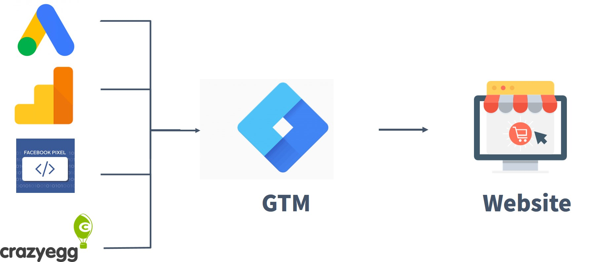
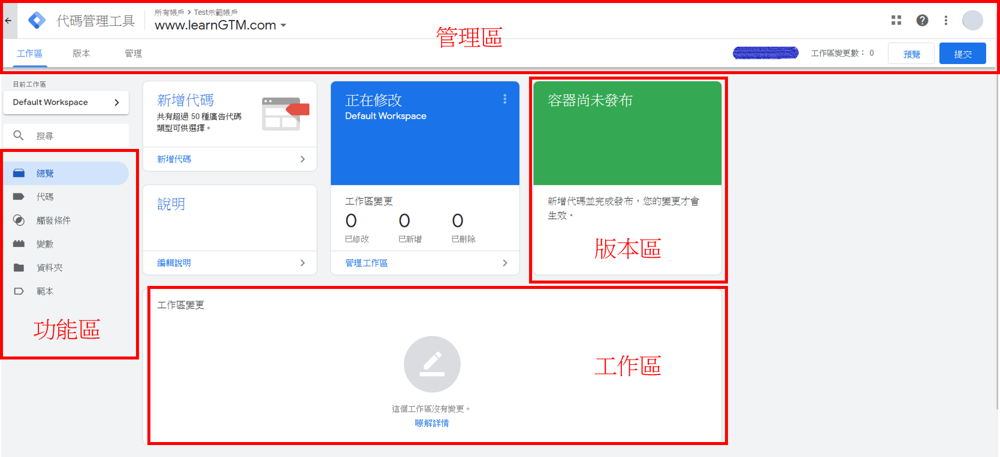
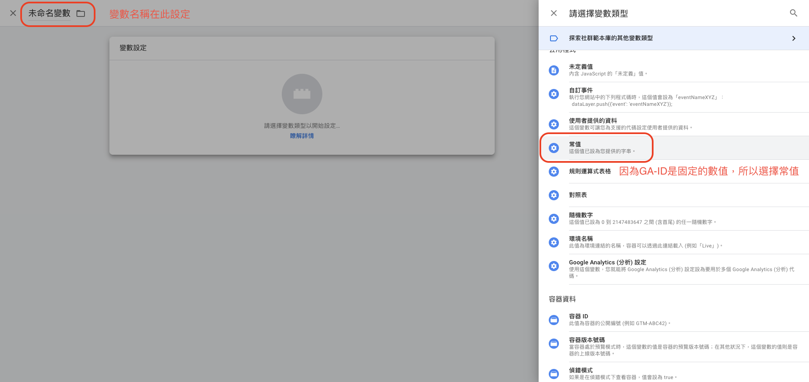
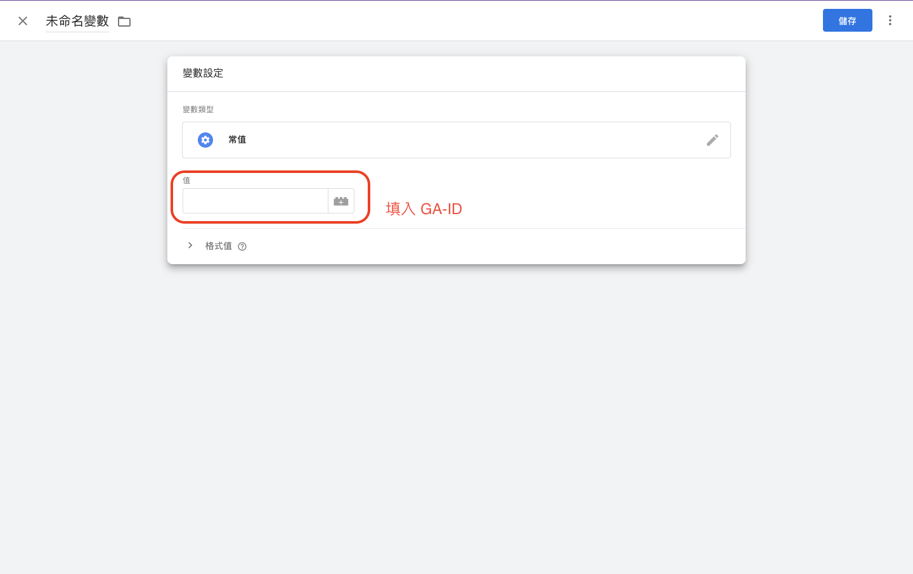
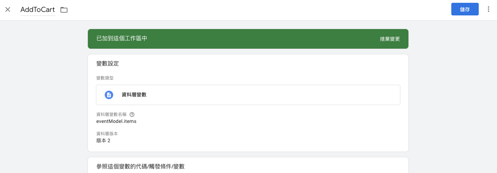
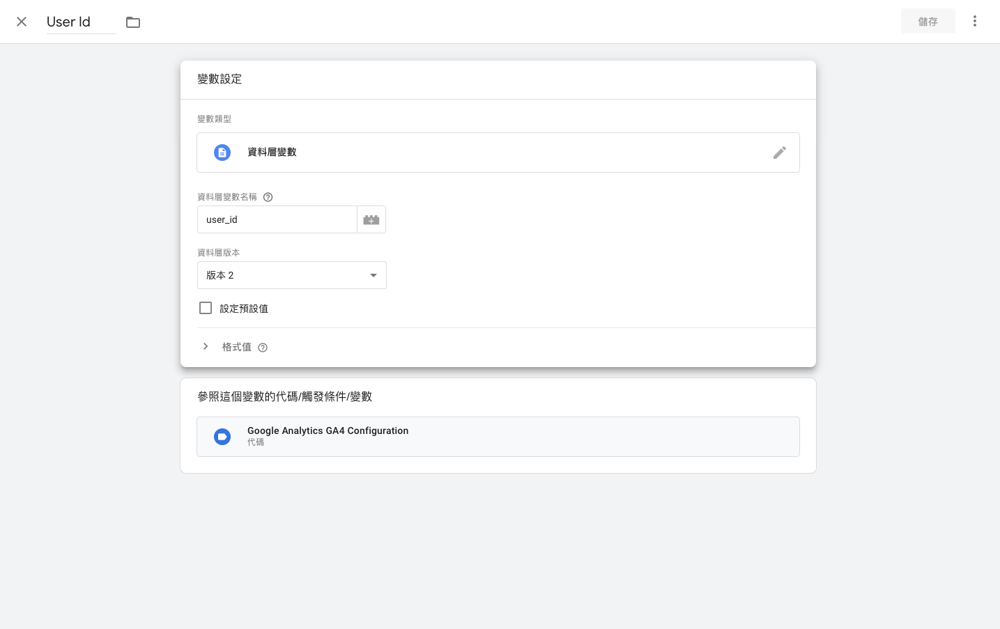
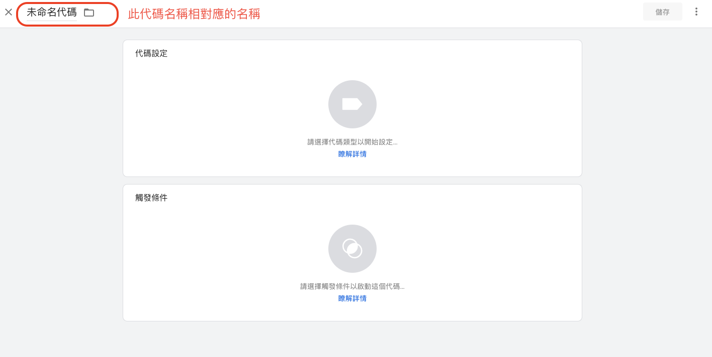
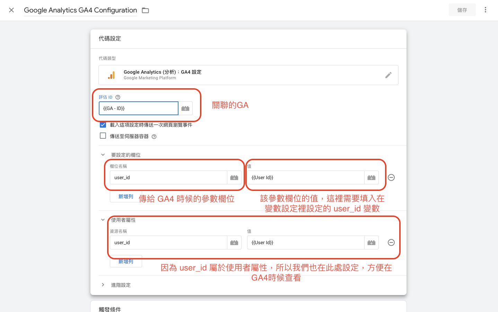
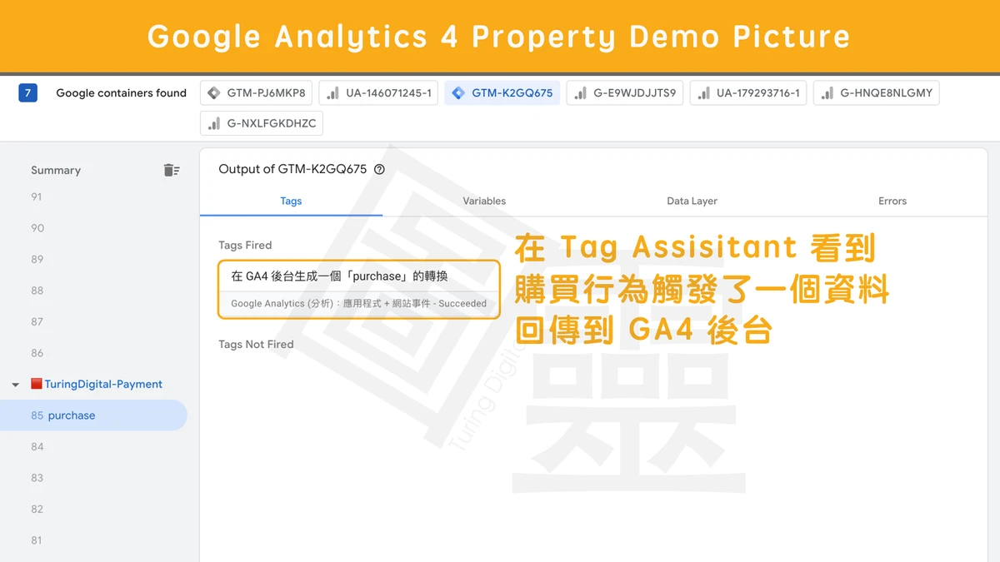

# GTM

 Google 代碼管理工具（Google Tag Manager, 簡稱 GTM）是一套，代碼管理系統。有以下幾個優點：

- 網站分析師與行銷人員不用更改網站的程式碼
- 透過 GTM 即能輕易地將各種追蹤程式碼以及第三方應用工具安裝到網站中
- 追蹤和管理都在同一個平台完成

 

## 申請 GTM 帳戶

- 新增 GTM 帳戶，資訊填寫及相關新增流程可以參考
  https://inboundmarketing.com.tw/websites-optimization/gtm%E6%95%99%E5%AD%B8-%E6%96%B0%E6%89%8B%E8%A7%80%E5%BF%B5%E7%AF%87.html

## 安裝 GTM 程式碼

### NUXT

- Install `vue-gTag`
    > vue-gtag: https://matteo-gabriele.gitbook.io/vue-gtag/
    ```
    npm i vue-gtag --save
    ```

- Create gtag.js to ./plugins with configuration
    > Plugin options: https://matteo-gabriele.gitbook.io/vue-gtag/plugin-options
    ```js
    import Vue from 'vue'
    import VueGtag from 'vue-gtag'

    export default ({ app }, inject) => {
      Vue.use(
        VueGtag,
        {
          customResourceURL: 'https://www.googletagmanager.com/gtm.js',
          customPreconnectOrigin: 'https://www.googletagmanager.com',
          globalDataLayerName: 'dataLayer',
          globalObjectName: 'gtag',
          defaultGroupName: 'default',
          config: {
            id: process.env.GTAG_ID,
            params: {
              send_page_view: false,
            },
          },
          ...Other config
        },
        app.router
      )

      inject('gtag', Vue.$gtag)
    }
    ```

- Add `GTAG_ID` and `gtag` plugin to the `nuxt.config.js`
    > Nuxt config: https://nuxtjs.org/docs/directory-structure/nuxt-config/
    ```js
    const nuxtConfig = {
      env: {
        GTAG_ID:
          process.env.NODE_ENV === 'production' ? 'GTM-XXXXXXA' : 'GTM-XXXXXXB',
      },
      plugins: [
        { src: '~/plugins/gtag', mode: 'client' },
        ...Other plugins
      ],
      ...Other nuxtConfig
    }
    ```

### 其他安裝方式

- 其他安裝方式可以繼續參考
  https://inboundmarketing.com.tw/websites-optimization/gtm%E6%95%99%E5%AD%B8-%E6%96%B0%E6%89%8B%E8%A7%80%E5%BF%B5%E7%AF%87.html

## 設定 GTM (以 GA4 為例)

### GA4

- 請參考其他文獻



### 設定變數

為了方便我們設定代碼，我們需要先將申請好的 Google analytics ID （GA-ID） 設定到變數中，方便我們重複使用。

1. 先點擊 `功能區` 中的 `變數`
2. 點擊 `變數介面` 中 `使用者定義的變數` 區右上的 `新增` 按鈕
3. 點擊 `變數設定` 中間的圖示，選擇變數的類型（如下圖）

4. 由於 `GA-ID` 是固定的數值，所以選擇 `常數`
5. 設定完變數類型後，在 `值` 的地方填上 `GA-ID` 並點擊右上角的儲存後，即完成 `GA-ID` 的變數設定


另外為了能了解個別用戶及其做的事情，我們另外需要設定 `user_id` 及 `add_to_cart`（添加到購物車的事件）

1. 同樣透過 `使用者定義的變數` 來新增 `user_id` 及 `add_to_cart` 兩個變數
2. 變數類型選擇 `資料層變數`
3. `資料層變數名稱` 在設定時有幾個注意事項：
    - 需要和技術討論使用的資料格式
    - 如果是透過技術埋點，並使用 `gtag function` 傳入的資料都會在 `eventModel` 中
    所以，在 `add_to_cart` 變數所填入的 `資料層變數名稱` 是該資料的路徑 `eventModel.items`
    
4. 資料層版本請選擇 `版本2` - [詳細差別請參考](https://www.turingdigital.com.tw/blog/ga4-ecommerce-guide)

5. 保存完後我們便可以開始設定代碼

### 設定代碼

為了方便辨識個別用戶，我們需要先設定一個共用的代碼（For GA4），並將 `user_id` 傳給指定的運營工具（e.q. GA4）

設定 `user_id` 相關的代碼
1. 先點擊 `功能區` 中的 `代碼`
    
2. 點擊 `代碼設定` 中的圖示
    - 代碼設定即為設定 `追蹤事件的程式碼片段`
    - 類似分流器的概念，能讓我們選擇使用那個運營工具來分析/收集數據
3. 代碼類型在此選擇 `Google Analytics（分析）：GA4設定`
4. 評估 ID 則是需要填入我們剛剛在 `設定變數` 中設定的 `GA-ID 名稱`（用 `{{變數名稱}}` 表示使用 `設定變數` 裡的變數）
5. 在 `要設定的欄位中` 的 `欄位名稱`需設為**要傳給GA4的參數欄位名稱**而 `值` 則為 `設定變數` 中設定的 `User id 名稱`


設定完 `user_id` 後便是我們關注的用戶操作行為 `add_to_cart` 設定

設定 `add_to_cart` 相關的代碼
1. 一樣先新增 `代碼`
2. 代碼類型在此選擇 `Google Analytics（分析）：GA4事件`
3. `設定代碼` 選擇剛剛上一步設定 `user_id` 代碼
4. `事件名稱` 設定為 `add_to_cart` 以捕捉該事件
    - 注意：關於事件名稱通常需要配合技術在專案程式碼中做埋點設置，相關協作在 mixpanel 有提出合適的解決方案 - [Tricking plan](https://help.mixpanel.com/hc/en-us/articles/115004519886-Creating-a-Tracking-Plan)
5. 最後在 `事件參數` 的部分一樣是參考設定 `user_id` 相關代碼的觀念來設置 `事件參數`
    - 注意：由於 `add_to_cart` 並非使用者屬性，所以不需設置 `使用者屬性` 欄位

### 設定觸發條件

為了能讓設定好的 `代碼` 能開始運作，我們還需要設定 `觸發條件`，才能在適當的條件（分辨用戶操作的條件）下，觸發 `代碼` 並將資料傳送給我們設定好的運營工具來分析/收集數據 (e.q. GA4)。

1. 先點擊 `功能區` 中的 `觸發條件`
2. 點擊 `觸發條件` 欄位右上角的新增按鈕
3. 點擊中間圖示選擇 `觸發條件類型`
    - 絕大部分的 `觸發條件類型` 都可以自動被 GA4 支持，所以都可以在不需要技術支持情況下，蒐集到用戶資訊

4. 選擇 `自訂事件`，並填入 `事件名稱`
    - 注意：`事件名稱` 需要和技術溝通過後，請技術將相對的事件埋入程式碼中，以收集精確的用戶操作數據。

    - 實際程式碼如下： https://developers.google.com/tag-platform/gtagjs/reference
      ```js
      gtag('event', 'add_to_cart', { item: ['1', '2'] })
      ```
5. 設定完 `觸發條件` 後，再回到 `代碼`，將 `觸發條件` 設定到希望觸發的代碼上，即可準備進行觸發測試

### GTM 測試

1. 點擊 GTM 介面右上角的 `預覽` 按鈕，即會打開 `Tag assistant` 的頁面
2. 在 `Your website's URL` 中填入要執行測試的網址
    - 需要確保該網址有植入對應 GTM-ID 的網址
    - 需要確保有載入 `https://www.googletagmanager.com/gtm.js`
3. 點擊 `Connect` 便會開始執行測試（執行的網址會另外新頁面）
4. 在打開的新頁面中，點擊埋設 gtag 的按鈕
5. 回到 `Tag assistant`，在左方 `summary` 欄位查看是否有跳出事件（如下圖）

6. 如果有順利跳出事件，且 `Output of GTM-{ID}` 區的 `Data Layer` 有成功將埋點的客製化資料包含在 eventModel 中，即算完成。

Reference:
- https://inboundmarketing.com.tw/websites-optimization/gtm%E6%95%99%E5%AD%B8-%E6%96%B0%E6%89%8B%E8%A7%80%E5%BF%B5%E7%AF%87.html
- https://www.turingdigital.com.tw/blog/ga4-ecommerce-guide
- https://developers.google.com/tag-platform/gtagjs/reference
