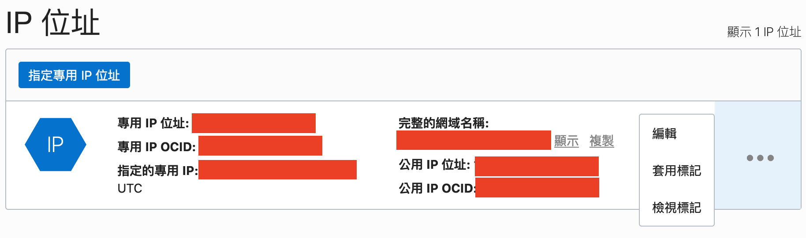

# 網站架設流程

## Server

由於 `oracle cloud` 是免費提供給開發者使用（目前基礎款為終身免費）因此我選用 `oracle cloud` 來入門。

[申請 Oracle cloud free](https://www.oracle.com/tw/cloud/free/)  
[申請流程](https://zhujitips.com/1613)  

### Oracle cloud

1. 建立 VM
    - 按照指示建立 VM
    - Operating system (OS) 我使用的是 `Ubuntu`

2. 選定好 VM 建立之後會需要設定 SSH
    - 建立 [SSH key](/server/ssh.md)
        ```sh
        ssh-keygen -t rsa -b {port}
        ```
    - 將生成的 `.pub` 上傳

3. 設定網域
    - 設定好 SSH 後會進入 `Compute > Instances > Instance Detail` 頁面
    - 左側選則 `Attached VNIC` (連附的VNIC)
    - 點選右側區塊的 `Primary VNIC`
    - 左側選擇 `IP Addresses`
    - 編輯 IP
    
    - 編輯 IP 時候可以選擇 `固定IP` 或是 `暫時IP`

4. 安裝 `docker`

    [reference](https://phoenixnap.com/kb/how-to-install-docker-on-ubuntu-18-04)

    ```sh
    # 更新 apt-get (Ubuntu 管理套件)
    sudo apt-get update

    # 我有嘗試按照官網的步驟，但是沒安裝成功
    # 具體可能要研究一下。。。
    sudo apt install docker.io

    # 設定運作時候便啟動 docker
    sudo systemctl start docker
    sudo systemctl enable docker

    # 測試 docker 是不是安裝成功
    docker --version
    ```

