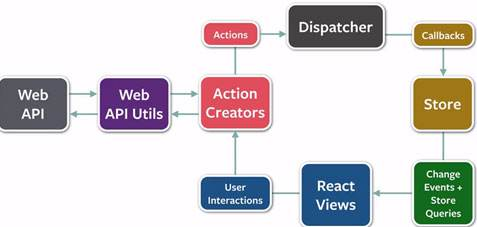

# Full-Stack Developer

[Full stack developer](https://medium.com/coderbyte/a-guide-to-becoming-a-full-stack-developer-in-2017-5c3c08a1600c) 中文定義為 `全棧工程師`，主要的定義如下：

> Being a Full-Stack Developer doesn’t mean that you have necessarily mastered everything required to work with the front-end or back-end, but it means that you are able to work on both sides and understand what is going on when building an application.

泛指能夠進行前端、後端開發的工程師，他們能夠理解，甚至能建構前、後端整體架構及開發的人。他們不一定需要精通每個技術環節，但能確保獨立完成產品開發。因此也讓傳統的技術開發模式，多了很多靈活性，使得產品開發上更為有效率。

## 過去的開發模式（以網頁開發舉例）

在早期做技術其實相對單純（能做到的效果也不多），通常是 `產品人員` 交付 `設計人員` 處理好 `高保真` 後直接由 `技術人員` 進行開發。

```
產品 -> 設計 -> 技術
```

但是隨著技術發展、更新，人們對於視覺的需求越來越高，以網頁為例子，`HTML` 、 `CSS` 和 `JS` 效能越來越好，`技術人員` 的開發逐漸跟不上需求，因此逐漸產生了 `設計人員` 同時要負責 `HTML` 及 `CSS` 撰寫的需求 `Adobe Dreamweaver` 就此孕育而生，讓 `設計人員` 在設計的同時完成 `HTML` 及 `CSS` 的生成。

```
產品 -> 設計 -> HTML + CSS -> 技術
```

在越來越多的 `設計人員` 及 `技術人員` 投入 `HTML` 、 `CSS` 和 `JS` 的開發後，伴隨著硬體設備的顯著提升，`Front-end（前端）` 一詞誕生。`前端` 的工作職責主要是針對 `設計人員` 設計需求於與實現，並接入 `後端` 人員開出的 `API（接口）`，進而完成產品需求。

```
產品 ---> 設計 -> 前端技術人員
     |              |
     |             API
     |              |
     `--------> 後端技術人員
```

### 框架戰爭

硬體技術發展從未停止，效能及技術的迭代更是日新月異，瀏覽器百家爭鳴，規範化跟不上技術的演進，`前端技術人員` 面對排山倒海的需求及各家裝置的兼容，搞得開發者哀鴻遍野。因此開始有技術大神開發 `函式庫（Library）`，解決 `前端技術人員` 在開發效率上的問題，最廣為人知的莫過於 [jQuery]。

本人認為 [jQuery] 除了提供許多好用的 `Library` 外，最大的貢獻莫過於兩點：
1. [ajax 問題](https://zh.wikipedia.org/wiki/AJAX)
2. 兼容性

因此，早期為了提高網頁的開發效率，幾乎所有的 `前端技術人員` 都會使用 [jQuery] 來開發網頁產品。但是 [jQuery] 對於個人開發幫助很大，卻對團隊開發效益有限，慢慢的前端開始倡導使用 `MVC`、`MVVM` 及 `MVP` 等架構，方便團隊共同開發。為了對應這些架構，前端`框架（framework）`也開始慢慢出現，以下為各個架構對應的 `framework`

- MVC: [Backbone.js]
- MVVM: [Angular]

當然，`framework` 不只這些，這裡只是提出比較有名的而已。

### 頂上戰爭

隨著 [W3C] 網頁標準逐漸統一，另一方面針對網頁標準化，[grunt] 、 [gulp] 及 [webpack] 工具問世，為網頁開發提供更多可能性，包括 `程式碼工程化`。

#### 工具

[grunt] 及 [gulp] 個人認為是蠻相近的任務執行工具（可能在小弟我用的功能不多），有興趣的還是自己看一下。在此主要提一下 [webpack] 畢竟現在 [webpack] 已經是必備的專案開發工具了。

[webpack] 到目前為止已經發展到版本 4，到這個版本除了效能顯著提升以外，最大的特色就是 `Zero Configuration`，大幅度的提高上手難易程度，默認的配置就可以讓你專注在專案實現上，真心建議大家升級。

> webpack 可以做些什麼

[webpack] 算是一個集成工具，在前端的領域裡面有幾個目的：
1. 壓縮程式碼
2. 混淆
3. 兼容
4. 模塊化專案
5. 使用 ES2017+、CSS4、HTML5 功能

正如之前所提到使用 [jQuery] 的其中一個目的 - `兼容`，[webpack] 是透過使用 [browserify]/[babel] 進行 `兼容`、`壓縮程式碼`...等，讓開發者專注在開發上，增加開發效率。我個人是使用 [babel] 處理 `javascript(js)` 使用 [postcss] 處理 `css`。

P.S. `postcss` 其實可以處理很多事情，我目前使用這個工具是為了使用 `CSS4` 的功能，個人比較喜歡遵循標準化。如果只是為了兼容瀏覽器其實可以考慮只用 `Autoprefixer` 這個工具。

#### New challenger

隨著 [webpack] 慢慢強大，`framework` 也伴隨著新的概念，出現了新的挑戰者 [React] / [Vue]。`React` 和 `Vue` 的比較開始到現在從沒停過，兩個概念相近，也是為了解決同樣的問題，能夠使用的插件也大致相同。有興趣的人可以[研究一下](https://www.cnblogs.com/mazhenyu/p/9342804.html)。

在這裡要提的還是 [React] （因為是 React 開始倡導這個概念的），[React] 的出現伴隨著幾個新穎的概念：

1. Flow 架構
2. Single data tree
3. Inline-style
4. Virtual DOM（網路上有很多文章，這裡就不多加描述）
5. React Native

> `Flow` 和 `Single data tree` 讓邏輯更加清晰



[Redux] 是 `Flow` 概念下的一個前端資料處理層的框架，主要定義了資料處理的形態和流向，使得數據變得容易追蹤和預期，每一次的用戶操作就像是一次的流動循環，從 `user interactions` 開始到 `React views` 結束，就如同 `React` 在組件的生命週期循環一樣。因此，`React` + `Redux` 其實還是最好的組合。

> `Inline-style` 配合 `js` 取代 `.css`

在實際實作之後，這個其實只能說是個理想，原因在於 `CSS4` 實在太強大，捨棄 `CSS4` 網頁能夠識做的事情就少了很多，`React` 提出的這個概念還不如 `Vue` ，使用 `webpack` 模塊化，配合 `vue-loader` 處理 `.vue` 達成， `CSS`、`HTML` 和 `Js` 三位一體。

> `React Native` 夢碎的大前端概念？！

我相信不少人因為這個而去學習 [React]，但就目前看來，還是太天真了，這個專案持續了很久，但是都沒有正式的 release ，真要說的話，初心還是不錯的，只是還是有很多問題沒有解決。想要踏入的人，還是看看就好，或是看看 [WebAssembly]?

### 小段總結

在前端發展至今，[webpack] 已經是不可或缺的工具，讓你能夠使用新的標準化語法和別人一起共同作業。`framework` 的誕生，也讓彼此合作上有個立基點。甚至在開源的時代，造輪子之前還是多搜尋，多看看是不是有人寫了同樣的工具，同樣的插件，不需要重複造輪子。

## DevOps

> DevOps（Development和Operations的组合词）是一组过程、方法与系统的统称，用于促进开发（应用程序/软件工程）、技术运营和质量保障（QA）部门之间的沟通、协作与整合。

[先看看別人怎麼說](../journal/2018.05.16.md)

歸納幾個重點：

1. 減少變更的範圍 - 小步快跑
    - 目的在於同樣時間內增加迭代次數，快速嘗試
2. 加強發布協調
    - 強調各個部門合作協調（運營、產品、技術）
3. 自動化
    - 自動化發布
    - 自動化測試

自動化意味著可以減少出錯的機會，但同時也伴隨著一些需求。包括：

1. 規範化
2. 溝通
3. 每個人員對於整個開發流程（work-flow）的遵守和默契

> 如何 `規範化`

對於自己的要求：
1. 使用 [eslint]、[stylelint]...等規範化工具
2. 養成好的 `commit` 習慣
    - 針對每個功能或是 issue 進行 commit
    - 透過標題能知道這次修改的東西大概是什麼
    - 遵從 commit 的格式
3. 使用規範化的註解 [JSDoc]
4. 增進程式碼可讀性
5. 不重複造輪子
    - 多使用開源框架
    - 如果輪子不好，應該也是 `pr` 這個輪子

對於團隊的要求：
1. 如果有 `CLI` 就用 `CLI`
2. 遵從 `git work flow`
3. 團隊彼此進行 `code review`
4. 團隊中都使用同一種 `規範化設定`
5. 盡可能使用同一種框架
6. 多建構團隊可共用的 `Tool library`

## 大前端

大前端一詞是在中國發展出來的一個前端名詞，代表能夠撰寫 web,  app(android and iOS) 及 PC 應用程式的人，相當於是同時精通多種前端語言的開發者。

個人認為，在過去 Facebook 野心很大，希望利用 react 及 react-native 透過學一次，寫 web 和 app 的方式，希望能夠做到大前端的效果，但是直到今天 react-native 還尚未正式 release (version > 1.0.0)，或許這看上去就像是一場夢吧...

### 測試工具

#### 遠端調適工具 weinre
https://people.apache.org/~pmuellr/weinre/docs/latest/Home.html

- ***Install***

```
sudo npm -g install weinre
```

- ***Use***

1. Run command
```
weinre --httpPort 8888 --boundHost -all-
```

2. 查詢自己本機 IP （Web inspector 網址則為 `自己IP:8888`）
3. 網址輸入 `自己IP:8888`
4. 複製該頁面裡面 `Target Script` 裡提供的 script `<script src="http://自己IP:8888/target/target-script-min.js#anonymous"></script>`
5. 在要測試專案裡面放入該 js 並運行

#### 

[jQuery]:https://jquery.com/
[MVC]:https://zh.wikipedia.org/wiki/MVC
[MVVM]:https://zh.wikipedia.org/wiki/MVVM
[Backbone.js]:https://backbonejs.org/
[Angular]:https://angular.io/
[W3C]:https://zh.wikipedia.org/wiki/%E4%B8%87%E7%BB%B4%E7%BD%91%E8%81%94%E7%9B%9F
[webpack]:https://webpack.js.org/
[gulp]:https://gulpjs.com/
[grunt]:https://gruntjs.com/
[browserify]:http://browserify.org/
[babel]:https://www.babeljs.cn/
[postcss]:https://postcss.org/
[React]:https://reactjs.org/docs/getting-started.html
[Vue]:https://cn.vuejs.org/v2/guide/
[Redux]:https://redux.js.org/
[WebAssembly]:https://webassembly.org/
[eslint]:https://cn.eslint.org/
[stylelint]:https://stylelint.io/
[JSDoc]:http://www.dba.cn/book/jsdoc/
